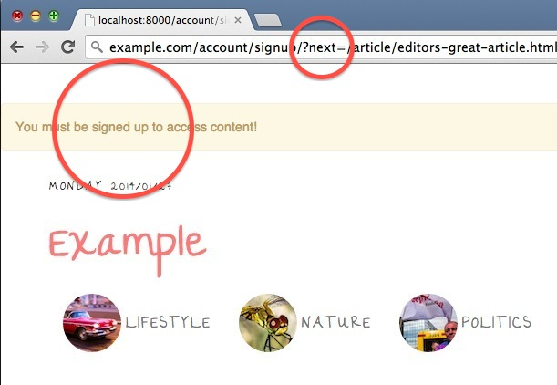
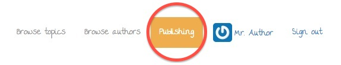
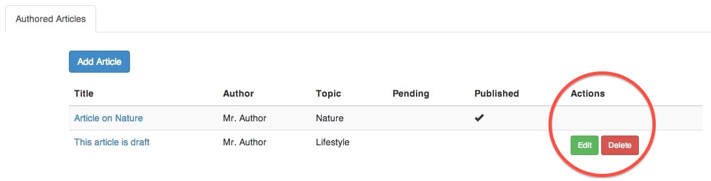
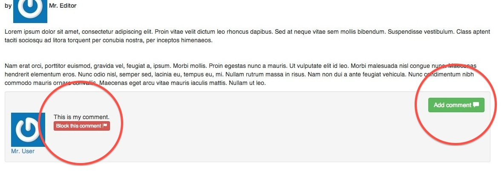

# OUTDATED!
## A new example for v2.0.0 coming soon...

---

# django-permissionsx-example

Example project for [django-permissionsx](http://github.com/thinkingpotato/django-permissionsx/) package.

## What's inside

This example:

* Depends on Django 1.6, Python 2.7 and django-permissionsx 1.3.0.
* Uses custom user model.
* Shows basic usage of permissions applied for views, templates and external API.
* Among other things, uses LESS, bootstrap, django-allauth, tinymce and django-avatar.

One Django setting was defined specifically, although it's default behaviour:

* `PERMISSIONSX_LOGOUT_IF_DENIED = False`

## In order to run this example

```
$ git clone https://github.com/thinkingpotato/django-permissionsx-example.git
$ cd django-permissionsx-example
$ pip install -r ./requirements.txt
$ ./db_reset_load.sh
$ ./manage.py runserver
$ open http://localhost:8000/
```

## Short introduction with screenshots

### Conditional redirect with message

If users are not allowed to access specific content (in this case articles are visible only to registered users), they will be redirected to a signup screen with a message explaining what is going on.

In order to achieve that you must:

* Define permissions with a condition, that if not met a user should be redirected [Example: profiles/permissions.py](example/profiles/permissions.py#L20-22).
* Apply permissions to selected view. View must either use `DjangoViewMixin` or inherit from one of the generic Django views accessible from `permissionsx.contrib.django.views` [Example: content/views.py](example/content/views.py#L127-133).



### Django templates

With `django-permissionsx` you can also control the way template is being rendered using the permissions previously defined for views.

Steps you must take:
* As always, permissions need to be defined first [Example: profiles/permissions.py](example/profiles/permissions.py#L25-27). Note that in this case `editor_or_administrator` is reused to simplify the code.
* Save permission checking result as template variable [Example: templates/base.html](example/templates/base.html#L7).
* Check that result inside the included template [Example: templates/utility.html](example/templates/utility.html#L6-8).



You may also use permissions inside tables for displaying actions only if some conditions are met. For example, in this case Author is allowed to edit only the articles, that were not yet published by the Editor. [Example: content/templates/content/article_list.html](example/content/templates/content/article_list.html#L43-47). Note, that the same permissions definition applies to the view responsible for handling requests [Example: content/views.py](example/content/views.py#L95-124).



### Tastypie integration

Permissions defined for views and templates can also be reused for building your Restful API using Tastypie. For example, in this project all registered users are allowed to post comments, however only "staff" users are allowed to block them. [Example: content/api.py](example/content/api.py#L29-46)


